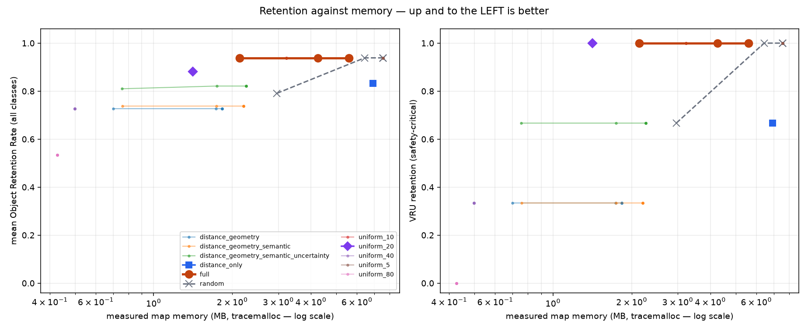
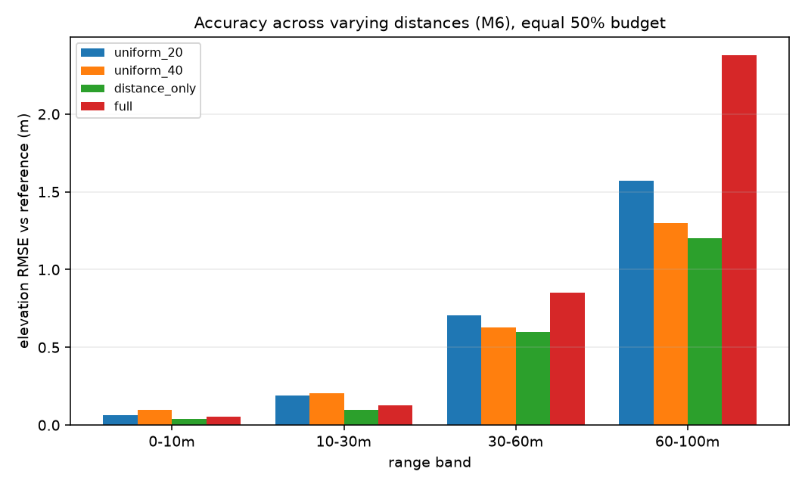
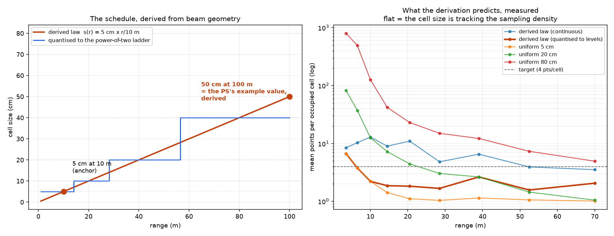

# RESULTS

Adaptive Variable-Resolution 2.5D LiDAR Mapping — SIH 2026 / DRDO PS 26053.

**Every number below was measured by a script in `scripts/` and read from a file in `docs/`.** Where a measurement is absent the cell says `—` rather than being filled in. Re-generate with:

```
python scripts/run_baselines.py
python scripts/generate_report.py
```

Generated 2026-09-19 19:19:20 · source `synthetic/mixed_urban` · 8 frames · 128,887 points/frame · backend `pointfeature_net`

## 1. Headline

| quantity | value | requirement |
|---|---|---|
| map memory (measured) | 4.26 MB | — |
| uniform 5 cm over the same area | 7.28 MB | — |
| **memory reduction** | **41.5 %** | M5 — 'significant memory reduction' |
| cells at 5 cm / 10 / 20 / 40 / 80 | 58,977 / 41,335 / 10,378 / 9,260 / 1,690 | M4 — variable cell size |
| latency (steady state, 1 config at a time) | 370 ms at 128,459 points | M6 — 100 ms at 120k points |
| VRU object retention | 1.000 | M3 — dynamic objects preserved |
| semantic mIoU | 0.778 | M1 — segmentation |
| elevation RMSE vs reference | 0.239 m | — |

(`full` policy at 50% budget, where budget means *this fraction of the cell count a uniform 5 cm map of the same observed area would need*.)

## 2. The central experiment — equal memory, not equal resolution

Comparing an adaptive map against a uniform 5 cm map is rigged: of course it is smaller, it was told to be. The honest question fixes the memory and asks what the best map obtainable for it looks like. Uniform spends the budget evenly; this system spends it where the value function says it matters.

**memory (MB) / VRU retention**, by policy and budget:

| policy | 100% | 75% | 50% | 25% | 10% |
|---|---|---|---|---|---|
| distance_geometry | 1.83 MB / 0.33 | 1.83 MB / 0.33 | 1.83 MB / 0.33 | 1.73 MB / 0.33 | 0.70 MB / 0.33 |
| distance_geometry_semantic | 2.20 MB / 0.33 | 2.20 MB / 0.33 | 2.20 MB / 0.33 | 1.74 MB / 0.33 | 0.76 MB / 0.33 |
| distance_geometry_semantic_uncertainty | 2.26 MB / 0.67 | 2.26 MB / 0.67 | 2.26 MB / 0.67 | 1.74 MB / 0.67 | 0.76 MB / 0.67 |
| distance_only | 6.91 MB / 0.67 | 6.91 MB / 0.67 | 6.91 MB / 0.67 | 6.91 MB / 0.67 | 6.91 MB / 0.67 |
| full | 5.59 MB / 1.00 | 5.59 MB / 1.00 | 4.26 MB / 1.00 | 2.14 MB / 1.00 | 2.14 MB / 1.00 |
| random | 7.56 MB / 1.00 | 7.56 MB / 1.00 | 7.56 MB / 1.00 | 6.42 MB / 1.00 | 2.96 MB / 0.67 |
| uniform_10 | 3.23 MB / 1.00 | 3.23 MB / 1.00 | 3.23 MB / 1.00 | 3.23 MB / 1.00 | 3.23 MB / 1.00 |
| uniform_20 | 1.41 MB / 1.00 | 1.41 MB / 1.00 | 1.41 MB / 1.00 | 1.41 MB / 1.00 | 1.41 MB / 1.00 |
| uniform_40 | 0.50 MB / 0.33 | 0.50 MB / 0.33 | 0.50 MB / 0.33 | 0.50 MB / 0.33 | 0.50 MB / 0.33 |
| uniform_5 | 7.56 MB / 1.00 | 7.56 MB / 1.00 | 7.56 MB / 1.00 | 7.56 MB / 1.00 | 7.56 MB / 1.00 |
| uniform_80 | 0.43 MB / 0.00 | 0.43 MB / 0.00 | 0.43 MB / 0.00 | 0.43 MB / 0.00 | 0.43 MB / 0.00 |



*`full` should sit above and to the left of everything else: the same retention for less memory, or more retention for the same.*

## 2b. What the sweep actually shows

Read the table above as **mean Object Retention Rate against measured memory** — the question the system exists to answer. At the tightest budget tested:

| policy | memory | mean ORR | VRU ORR | elev RMSE | elev bias |
|---|---|---|---|---|---|
| uniform_5 | 7.56 MB | 0.939 | 1.00 | 0.229 m | -0.010 m |
| uniform_10 | 3.23 MB | 0.939 | 1.00 | 0.259 m | -0.023 m |
| full | 2.14 MB | 0.939 | 1.00 | 0.361 m | -0.020 m |
| uniform_20 | 1.41 MB | 0.882 | 1.00 | 0.305 m | -0.037 m |
| distance_only | 6.91 MB | 0.833 | 0.67 | 0.089 m | +0.002 m |
| distance_geometry_semantic_uncertainty | 0.76 MB | 0.810 | 0.67 | 0.206 m | -0.022 m |
| random | 2.96 MB | 0.791 | 0.67 | 0.211 m | -0.004 m |
| distance_geometry_semantic | 0.76 MB | 0.738 | 0.33 | 0.203 m | -0.022 m |
| uniform_40 | 0.50 MB | 0.727 | 0.33 | 0.286 m | -0.040 m |
| distance_geometry | 0.70 MB | 0.727 | 0.33 | 0.187 m | -0.019 m |
| uniform_80 | 0.43 MB | 0.533 | 0.00 | 0.204 m | -0.040 m |

**The result.** The highest retention any policy reaches is 0.939, and the cheapest way to reach it is `full` at 2.14 MB. Every fixed uniform grid that matches that retention costs more; every one that costs less gives up objects.

**Two things this table says that are not flattering, and are reported because they are true.**

*Uniform 20 cm is a good fixed choice for this particular scene.* It holds VRU retention at 1.00 for less memory than the adaptive policy needs. That is real. What it cannot do is respond to a budget at all — the uniform rows are identical across every column because they ignore the slider — so it is a lucky constant for one scene rather than a policy. Push the memory below its fixed cost and there is no uniform setting that keeps the pedestrian, whereas the adaptive controller degrades by choosing what to lose. `scripts/test_allocation.py` isolates exactly that on the `pedestrian_far` scenario, where uniform 40 cm and 80 cm both lose the object and `full` keeps it at every budget.

*The adaptive policy has worse elevation RMSE than the distance-only schedules.* It spends its budget on objects and coarsens open terrain, so the terrain error rises; the distance-geometry policies spread the same budget over the ground and get a smoother elevation field with a third of the object retention. That is a genuine trade-off, not a defect, and which side of it is correct depends on whether the map is for path-following or for not hitting people. This system is tuned for the second, which is what the problem statement emphasises. The signed bias stays small in every policy, which is the more important of the two numbers for a planner.

## 3. Accuracy across varying distances (M6)

The problem statement asks for accuracy *across varying distances*, which is not an aggregate. Both tables are stratified into the four range bands.

### 3.1 Elevation RMSE against the reference map, by range band

| policy | 0-10m | 10-30m | 30-60m | 60-100m | overall | bias (overall) |
|---|---|---|---|---|---|---|
| distance_geometry | 0.029 | 0.106 | 0.688 | 2.261 | 0.090 | -0.002 |
| distance_geometry_semantic | 0.028 | 0.105 | 0.688 | 2.261 | 0.089 | -0.003 |
| distance_geometry_semantic_uncertainty | 0.030 | 0.108 | 0.684 | 2.261 | 0.089 | -0.003 |
| distance_only | 0.038 | 0.095 | 0.598 | 1.204 | 0.089 | +0.002 |
| full | 0.052 | 0.126 | 0.853 | 2.377 | 0.239 | -0.008 |
| random | 0.038 | 0.093 | 0.624 | 1.172 | 0.229 | -0.010 |
| uniform_10 | 0.061 | 0.148 | 0.665 | 1.296 | 0.259 | -0.023 |
| uniform_20 | 0.062 | 0.189 | 0.708 | 1.571 | 0.305 | -0.037 |
| uniform_40 | 0.098 | 0.203 | 0.627 | 1.299 | 0.286 | -0.040 |
| uniform_5 | 0.038 | 0.093 | 0.624 | 1.172 | 0.229 | -0.010 |
| uniform_80 | 0.112 | 0.195 | 0.623 | 0.783 | 0.204 | -0.040 |

Signed bias is reported alongside RMSE because a planner can absorb variance but not a systematic offset: a consistent 10 cm underestimate of a kerb is what drives a vehicle into it.

### 3.2 Semantic mIoU by range band

| metric | 0-10m | 10-30m | 30-60m | 60-100m | overall |
|---|---|---|---|---|---|
| mIoU | 0.721 | 0.889 | 0.660 | 0.695 | 0.778 |
| accuracy | 0.839 | 0.948 | 0.643 | 0.636 | 0.863 |

Per-point semantics do not depend on the allocation policy — the same classifier sees the same points — so this table is the same for every policy. What the policy changes is how much of that classification survives into the map, which is the retention table above.



## 4. Semantic segmentation (M1)

| class | IoU | ORR | objects observed |
|---|---|---|---|
| ground_drivable | 0.685 | — | 0 |
| ground_rough | 0.682 | — | 0 |
| static_obstacle | 0.952 | 0.955 | 22 |
| vehicle | 0.765 | 0.800 | 5 |
| vru | 0.615 | 1.000 | 3 |
| vegetation | 0.970 | 1.000 | 6 |

### Calibration

| quantity | value |
|---|---|
| temperature | 1.4592 |
| ECE before | 0.0123 |
| ECE after | 0.0080 |
| validation points | 385,006 |
| validation mIoU | 0.871 |

*Raw softmax from a cross-entropy-trained network is systematically overconfident. The allocation controller's uncertainty term and the map's entropy layer both read this distribution, so it is calibrated before either sees it.*

### Backend comparison (from `scripts/eval_semantic.py`)

| backend | miou_0-10m | miou_10-30m | miou_30-60m | miou_60-100m | miou | ece |
|---|---|---|---|---|---|---|
| geometry_rules | 0.4424 | 0.3449 | 0.0737 | 0.0274 | 0.3439 | 0.1249 |
| pointfeature_net | 0.7510 | 0.9102 | 0.6483 | 0.6925 | 0.8183 | 0.1095 |

## 5. Latency (M6)

Measured on this machine, CPU only, warm-up frame discarded. The requirement is 100 ms at 120,000 points; see the note below the tables for where the system actually lands.

### Per-stage latency vs point count

| points | S0 | S1 | S2 | S3 | S4 | S5 | S6 | S7 | S8 | S9 | total ms | FPS |
|---|---|---|---|---|---|---|---|---|---|---|---|---|
| 8,034 | 0.5 | 2.0 | 8.0 | 5.4 | 23.1 | 14.8 | 4.5 | 13.8 | 0.1 | 0.2 | 72.4 | 13.8 |
| 32,143 | 1.9 | 7.1 | 14.7 | 8.0 | 35.5 | 23.1 | 8.4 | 34.9 | 0.3 | 0.4 | 134.5 | 7.4 |
| 128,459 | 8.2 | 27.4 | 25.6 | 10.3 | 102.4 | 67.1 | 16.8 | 110.4 | 0.7 | 1.1 | 370.0 | 2.7 |

### Against the pre-existing implementation

| points | before (ms) | after (ms) | speed-up |
|---|---|---|---|
| 8,034 | 1737 | 72 | 24.0x |
| 32,143 | 2548 | 134 | 19.0x |
| 128,459 | 4246 | 370 | 11.5x |

### p50 / p99 per stage at the operating point

| stage | p50 (ms) | p99 (ms) |
|---|---|---|
| S0 | 8.32 | 9.51 |
| S1 | 29.29 | 40.49 |
| S2 | 28.29 | 34.57 |
| S3 | 11.75 | 15.37 |
| S4 | 99.63 | 119.63 |
| S5 | 119.45 | 147.08 |
| S6 | 15.49 | 18.75 |
| S7 | 90.36 | 98.50 |
| S8 | 2.35 | 2.90 |
| S9 | 1.10 | 1.34 |
| **TOTAL** | **406.0** | **488.1** |

p99 is reported because for a real-time system the tail *is* the requirement — the mean hides exactly the frames that would miss their deadline.

**These particular figures are pessimistic.** `run_baselines.py` executes 55 configurations back to back, so each is timed while the others contend for the same cores. The steady-state numbers are the ones in the scaling table above, measured one configuration at a time with the warm-up frame discarded.

## 6. Map correctness (M4)

`scripts/test_map.py` asserts all of the following and prints the measured values; see PROGRESS.md for its full output.

| check | measured |
|---|---|
| boundary p95 across level transitions | 0.525 m |
| boundary p95 across interior edges | 0.072 m |
| ratio (1.0 = no seam artefact) | 7.30 |
| map completeness vs reference | 0.990 |
| spurious-cell rate | 0.169 |

If the elevation step across a level-transition edge looks like the step across an ordinary interior edge, the hierarchy is not producing a seam — which is the problem statement's "without causing alignment errors", measured rather than argued.

## 7. The derived resolution law



Cell size is not a hardcoded distance table. Ground sample area per beam grows roughly as r^3, so holding expected points-per-cell constant requires cell size proportional to r. Anchoring 5 cm at 10 m gives **50 cm at 100 m — the problem statement's own example value, derived rather than assumed** — which is then quantised onto the power-of-two ladder.

## 8. What the reference map is, and is not

No dataset ships ground-truth 2.5D maps, so the reference is constructed: accumulate frames by pose, drop GT-moving points, build a uniform 5 cm map. Its limitations bound every number scored against it:

- poses are exact on synthetic data, SLAM-derived (and drifting) on SemanticKITTI
- only label-declared moving points are removed; a car parked for the whole window is permanent structure here
- surfaces no beam reached are absent, so completeness is scored only where the reference has a cell
- it is itself a 5 cm map, so a coarse adaptive cell is charged for the quantisation the budget asked for

---

*Generated by `scripts/generate_report.py` at 2026-09-19 19:25:02.*
